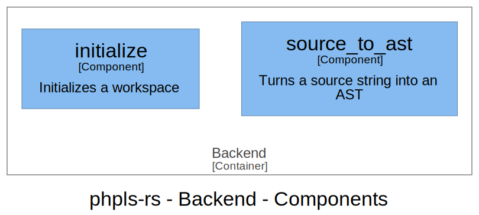

# Backend

The backend is the interface between the language service client (running in the editor of the developer)
and the actual meat of phpls-rs. It implements the Backend interface of tower-lsp.

## Processes

Relevant processes:

* [Initialize the workspace](processes/backend-initialize.md)
* [Source to AST](processes/backend-source_to_ast.md)