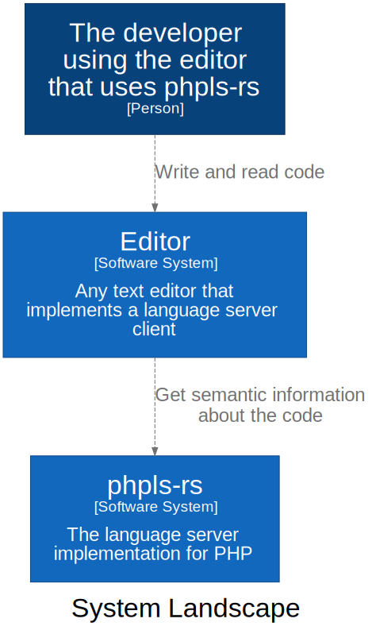

# Architecture

This document describes the architecture of phpls-rs. It serves as a quick first entry point into how
this code base is structured. 
The documentation is organized in a way that lets you drill down from a very high-level view until you reach almost
the code level.

## System landscape

The following diagram shows where phpls-rs fits into the development workflow.

To learn more about what phpls-rs is made of, have a look at its [components](phpls-rs.md).