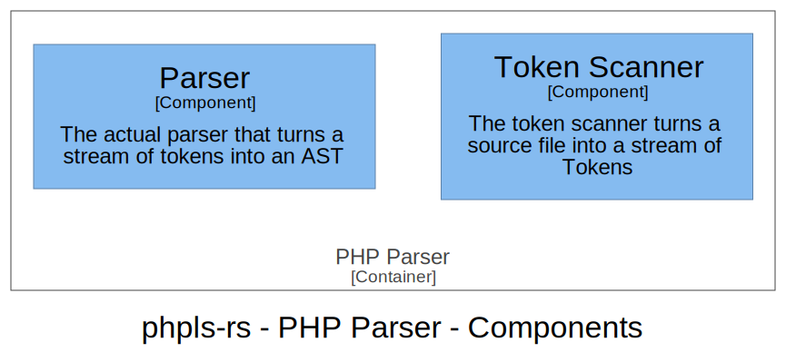

# PHP Parser

The PHP Parser basically consists of two components: A scanner, that turns a source string into
individual tokens, and a scanner, that takes that token stream and turns into an AST consisting of nodes.

