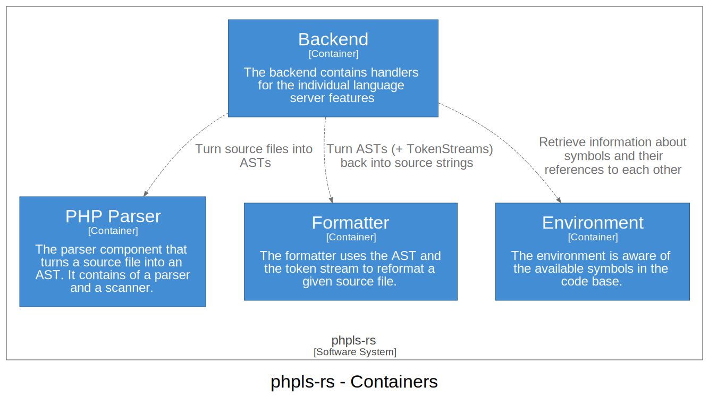

# System phpls-rs

phpls-rs consists of a number of components that interact with each other.

## Backend

The backend acts as the main interface between the language service client and phpls-rs.

[More information](backend.md)

## PHP Parser

The PHP Parser is used to turn a PHP source file into a token stream and an Abstract Syntax Tree.

[More information](php-parser.md)

## Formatter 

The formatter turns the parsed AST and token stream back into a source string, while fixing the formatting.

[More information](formatter.md)

## Environment

The environment module is aware of the existing symbols (classes, traits, interfaces, global functions and consts, etc.) and knows how to resolve references to each of them.

[More information](environment.md)